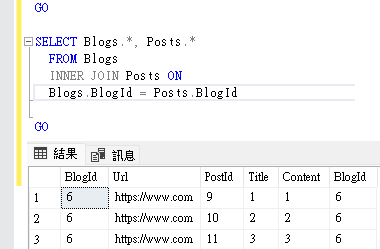
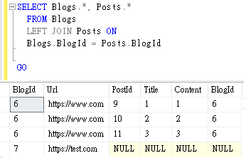

# Dapper
## 說明
個人練習

Dapper 自行撰寫SQL語法對Object做mapping, 彈性較EF高

## 套件安裝
```ps
# SqlClient
Install-Package System.Data.SqlClient

# Dapper
Install-Package Dapper
```

# 範例實作
## - 基本CRUD
依照官方基礎範例模型練習, 先建立好資料庫

1. Blog實作

    1. 資料模型Entity

        建立資料模型, 這邊不用像EF需要CodeFirst帶入所有欄位, 或外鍵關聯

        僅需要建立自己想要顯示的欄位即可
        ```C#
        // Repository/Entities/Blog

        namespace DapperWebApiTraining.Repository.Entities
        {
            public class Blog
            {
                public int BlogId { get; set; }
                public string? Url { get; set; }
            }
        }
        ```
        再做另一個版本, 想讓Blog包含Posts
        ```C#
        // Repository/Entities/BlogWithPost

        namespace DapperWebApiTraining.Repository.Entities
        {
            public class BlogWithPost
            {
                public int BlogId { get; set; }
                public string? Url { get; set; }

                public List<Post>? posts { get; set; }
            }
        }
        ```
    2. 實作介面

        Read有兩個版本一個包含Post一個不含
        ```C#
        // Repository/Interfaces/IBlogRepository
        
        using DapperWebApiTraining.Repository.Entities;

        namespace DapperWebApiTraining.Repository.Interfaces
        {
            public interface IBlogRepository
            {
                // C
                Task<int> CreateAsync(Blog blog);


                // R
                Task<Blog?> GetByIdAsync(int id);

                Task<BlogWithPost?>  GetByIdWithPostAsync(int id);

                Task<IEnumerable<Blog>> GetAllAsync();

                Task<IEnumerable<BlogWithPost>> GetAllWithPostAsync();

                // U
                Task<bool> UpdateAsync(Blog blog);

                // D
                Task<bool> DeleteByIdAsync(int id);
            }
        }
        ```
    
    3. 實作

        基本用法帶入SQL語法 + 參數

        自動將SQL字串中的@var, 自動將參數轉換為字串帶入

        ```C#
        // Repository/Implements/BlogRepository

        using DapperWebApiTraining.Repository.Interfaces;
        using DapperWebApiTraining.Repository.Entities;
        using Dapper;
        using System.Data.SqlClient;

        namespace DapperWebApiTraining.Repository.Implements
        {
            public class BlogRepository : IBlogRepository
            {
                private readonly string _connectString = @"Server=localhost\SQLEXPRESS;Database=EFCore6WebApiTraining;Trusted_Connection=True;MultipleActiveResultSets=True;User ID='';Password=''";

                // C
                public async Task<int> CreateAsync(Blog blog)
                {
                    using var conn = new SqlConnection(_connectString);

                    var sql =
                        @"INSERT INTO Blogs
                        (
                            Url
                        )
                        VALUES
                        (
                            @Url
                        );

                        SELECT @@IDENTITY;
                        ";

                    var id = await conn.ExecuteScalarAsync<int>(sql, blog);

                    return id ;

                }

                // R
                public async Task<Blog?> GetByIdAsync(int id)
                {
                    using var conn = new SqlConnection(_connectString);

                    return await conn.QueryFirstOrDefaultAsync<Blog>("SELECT TOP 1 * FROM Blogs Where BlogId = @id",
                        new
                        {
                            id = id,
                        });

                }

                public async Task<IEnumerable<Blog>> GetAllAsync()
                {
                    using var conn = new SqlConnection(_connectString);

                    return await conn.QueryAsync<Blog>("SELECT * FROM Blogs");

                }

                // U
                public async Task<bool> UpdateAsync(Blog blog)
                {
                    using var conn = new SqlConnection(_connectString);

                    var sql =
                        @"UPDATE blogs
                        SET Url=@Url
                        WHERE BlogId = @BlogId;
                        ";

                    var count = await conn.ExecuteAsync(sql, blog);

                    return (count > 0);
                }

                // D
                public async Task<bool> DeleteByIdAsync(int id)
                {
                    var conn = new SqlConnection(_connectString);

                    var sql =
                        @"DELETE FROM Blogs
                        WHERE BlogId = @id;
                        ";

                    var count = await conn.ExecuteAsync(sql, new { id = id });

                    return count > 0;
                }

            }
        }

        ```

        將BlogWithPost額外說明

        不一定要將Posts資料帶到Blog的`List<Post>`中

        也可以改成將你想顯示的欄位都包含, 合併查詢即可
        ```C#
        namespace DapperWebApiTraining.Repository.Entities
        {
            public class BlogWithPost
            {
                public int BlogId { get; set; }
                public string? Url { get; set; }
                public int PostId { get; set; }
                public string? Title { get; set; }
                public string? Content { get; set; }
            }
        }
        ```

        但這樣導致即使Blogs只有一筆資料, 
        
        取得資料時有多個Posts關聯, 導致有多筆資料,

        資料一多, 還要讓前端取得時要去判斷BlogId, 那些資料是一起的

        所以自己比較喜歡Blog包含Posts List欄位, 一眼就看得懂誰屬與誰的關聯

        ### GetAllWithPostAsync / GetByIdWithPostAsync 實作 

        `conn.QueryAsync<BlogWithPost, Post, BlogWithPost>`
        
        這樣去取得資料時會是長這樣

        

        如果一行行取出會導致Blog物件重複了, 同一個BlogId只需要建立一個物件

        後續`List.Add(Post)`即可, 因此資料額外儲存

        SQL 則使用`LEFT`讓Blog無視條件印出, 因為還是以Blog為主, 
        
        雖然INNER看似沒問題, 但萬一某個Blog沒有Posts關聯條件就不成立了
        
        

        ```C#
        public async Task<IEnumerable<BlogWithPost>> GetAllWithPostAsync()
        {
            using var conn = new SqlConnection(_connectString);

            var sql =
                @"SELECT b.*, p.*
                FROM Blogs b
                LEFT JOIN Posts p ON
                b.BlogId = p.BlogId
                ";

            // 由於有多個Blog包含多個Post, 因此複數Post, 每請求出來會出現重複Blog
            // 利用字典去儲存已存在的Blog, 並添加Post
            var blogDict = new Dictionary<int, BlogWithPost>();

            await conn.QueryAsync<BlogWithPost, Post, BlogWithPost>(sql, (b, p) =>
            {
                BlogWithPost? blog;
                if (!blogDict.TryGetValue(b.BlogId, out blog))
                {
                    blogDict.Add(b.BlogId, blog = b);
                }

                if (blog.posts == null)
                {
                    blog.posts = new List<Post>();
                }

                if (p != null)
                {
                    blog.posts.Add(p);
                }

                return blog;
            }, 
            splitOn: "PostId");

            return blogDict.Values;
        }

        public async Task<BlogWithPost?> GetByIdWithPostAsync(int id)
        {
            using var conn = new SqlConnection(_connectString) ;

            var sql =
                @"SELECT b.*, p.*
                FROM Blogs b
                LEFT JOIN Posts p ON
                b.BlogId = p.BlogId
                WHERE b.BlogID = @id
                ";

            BlogWithPost? blogResult = null;

            await conn.QueryAsync<BlogWithPost, Post, BlogWithPost>(sql, (b, p) =>
            {
                if (blogResult == null)
                {
                    blogResult = b;
                }

                if (blogResult.posts == null)
                {
                    blogResult.posts = new List<Post>();
                }

                if (p != null)
                {
                    blogResult.posts.Add(p);
                }

                return blogResult;
            },
            new { id = id },
            splitOn: "PostId");

            return blogResult;
        }
        ```
    4. 實作注入
        ```C#
        // Program
        using DapperWebApiTraining.Repository.Interfaces;
        using DapperWebApiTraining.Repository.Implements;

        builder.Services.AddTransient<IBlogRepository, BlogRepository>();
        ```
    
    5. WebApi使用

        參數物件
        ```C#
        // Parameters/BlogCreateParameter

        using System.ComponentModel.DataAnnotations;

        namespace DapperWebApiTraining.Parameters
        {
            public class BlogCreateParameter
            {
                [Required]
                public string? Url { get; set; }
            }
        }

        ```

        ```C#
        // Controllers/BlogController
        using DapperWebApiTraining.Repository.Interfaces;
        using DapperWebApiTraining.Repository.Entities;
        using DapperWebApiTraining.Parameters;
        using Microsoft.AspNetCore.Mvc;

        namespace DapperWebApiTraining.Controllers
        {
            [Route("api/[controller]")]
            [ApiController]
            public class BlogController : ControllerBase
            {

                private readonly IBlogRepository _blogRepository;
                public BlogController(IBlogRepository blogRepository) => _blogRepository = blogRepository;

                // C
                [HttpPost]
                public async Task<IActionResult> CreateAsync(BlogCreateParameter blog)
                {
                    return Ok(await _blogRepository.CreateAsync( new Blog() { Url = blog.Url} ) );
                }

                // R
                [HttpGet("{id}")]
                public async Task<IActionResult> GetByIdAsync(int id)
                {
                    var result = await _blogRepository.GetByIdAsync(id);

                    if (result == null)
                    {
                        return NotFound();
                    }

                    return Ok(result);
                }

                [HttpGet]
                public async Task<IActionResult> GetAllAsync()
                {
                    return Ok(await _blogRepository.GetAllAsync());
                }

                [HttpGet("withPost/{id}")]
                public async Task<IActionResult> GetByIdWithPostAsync(int id)
                {
                    var result = await _blogRepository.GetByIdWithPostAsync(id);

                    if (result == null)
                    {
                        return NotFound();
                    }

                    return Ok(result);
                }

                [HttpGet("withPost")]
                public async Task<IActionResult> GetAllWithPostAsync()
                {
                    return Ok(await _blogRepository.GetAllWithPostAsync());
                }

                // U
                [HttpPut]
                public async Task<IActionResult> UpdateAsync(Blog blog)
                {
                    return Ok(await _blogRepository.UpdateAsync(blog));
                }

                // D
                [HttpDelete("{id}")]
                public async Task<IActionResult> DeleteByIdAsync(int id)
                {
                    return Ok(await _blogRepository.DeleteByIdAsync(id));
                }
            }
        }
        ```

2. Post

    基本跟Blog相同, 少了關聯Entity, 單純Post

    Entity
    ```C#
    namespace DapperWebApiTraining.Repository.Entities
    {
        public class Post
        {
            public int PostId { get; set; }
            public string? Title { get; set; }
            public string? Content { get; set; }

            public int BlogId { get; set; }
        }
    }
    ```

    Interface
    ```C#
    using DapperWebApiTraining.Repository.Entities;

    namespace DapperWebApiTraining.Repository.Interfaces
    {
        public interface IPostRepository
        {
            // C
            Task<int> CreateAsync(Post post);


            // R
            Task<Post?> GetByIdAsync(int id);


            Task<IEnumerable<Post>> GetAllAsync();


            // U
            Task<bool> UpdateAsync(Post post);

            // D
            Task<bool> DeleteByIdAsync(int id);
        }
    }
    ```

    Implements
    ```C#
    using DapperWebApiTraining.Repository.Interfaces;
    using DapperWebApiTraining.Repository.Entities;
    using Dapper;
    using System.Data.SqlClient;


    namespace DapperWebApiTraining.Repository.Implements
    {
        public class PostRepository : IPostRepository
        {
            private readonly string _connectString = @"Server=localhost\SQLEXPRESS;Database=EFCore6WebApiTraining;Trusted_Connection=True;MultipleActiveResultSets=True;User ID='';Password=''";
            // C
            public async Task<int> CreateAsync(Post post)
            {
                using var conn = new SqlConnection(_connectString);

                var sql =
                    @"INSERT INTO Posts
                    (
                        Title, Content, BlogId
                    )
                    VALUES
                    (
                        @Title, @Content, @BlogId
                    );

                    SELECT @@IDENTITY;
                    ";

                var id = await conn.ExecuteScalarAsync<int>(sql, post);

                return id;
            }


            // R
            public async Task<Post?> GetByIdAsync(int id)
            {
                using var conn = new SqlConnection(_connectString);

                var sql =
                    @"SELECT TOP 1 * FROM Posts
                    WHERE PostId = @id
                    ";

                return await conn.QueryFirstOrDefaultAsync<Post>(sql, new { id = id });
            }


            public async Task<IEnumerable<Post>> GetAllAsync()
            {
                using var conn = new SqlConnection(_connectString);

                return await conn.QueryAsync<Post>("SELECT * FROM Posts");
            }


            // U
            public async Task<bool> UpdateAsync(Post post)
            {
                using var conn = new SqlConnection(_connectString);

                var sql =
                    @"UPDATE Posts
                    SET Title = @Title, Content = @Content
                    WHERE PostId = @PostId;
                    ";

                var count = await conn.ExecuteAsync(sql, post);

                return count > 0;

            }

            // D
            public async Task<bool> DeleteByIdAsync(int id)
            {
                using var conn = new SqlConnection(_connectString);

                var sql =
                    @"DELETE FROM Posts
                    WHERE PostId = @id
                    ";

                var count = await conn.ExecuteAsync(sql, new { id = id });

                return count > 0;
            }
        }
    }
    ```

    DI
    ```C#
    builder.Services.AddTransient<IPostRepository, PostRepository>();
    ```
    
    Parameters
    ```C#
    using System.ComponentModel.DataAnnotations;

    namespace DapperWebApiTraining.Parameters
    {
        public class PostCreateParameter
        {
            public string? Title { get; set; }
            public string? Content { get; set; }
            [Required]

            public int BlogId { get; set; }
        }
    }

    
    using System.ComponentModel.DataAnnotations;

    namespace DapperWebApiTraining.Parameters
    {
        public class PostUpdateParameter
        {
            [Required]
            public int PostId { get; set; }
            public string? Title { get; set; }
            public string? Content { get; set; }
        }
    }
    ```

    Controller
    ```C#
    using DapperWebApiTraining.Repository.Interfaces;
    using DapperWebApiTraining.Repository.Entities;
    using DapperWebApiTraining.Parameters;
    using Microsoft.AspNetCore.Mvc;

    namespace DapperWebApiTraining.Controllers
    {
        [Route("api/[controller]")]
        [ApiController]
        public class PostController : ControllerBase
        {
            private readonly IPostRepository _postRepository;
            private readonly IBlogRepository _blogRepository ;

            public PostController(IPostRepository postRepository, IBlogRepository blogRepository)
            {
                _postRepository = postRepository;
                _blogRepository = blogRepository;
            } 

            // C
            [HttpPost]
            public async Task<IActionResult> CreateAsync(PostCreateParameter post)
            {
                var blog = await _blogRepository.GetByIdAsync(post.BlogId);

                if (blog == null)
                {
                    return BadRequest("Blog不存在");
                }

                return Ok(await _postRepository.CreateAsync(new Post() 
                { 
                    Title = post.Title, 
                    Content = post.Content,
                    BlogId = post.BlogId,
                }
                ));
            }

            // R
            [HttpGet("{id}")]
            public async Task<IActionResult> GetByIdAsync(int id)
            {
                var result = await _postRepository.GetByIdAsync(id);

                if (result == null)
                {
                    return NotFound();
                }

                return Ok(result);
            }

            [HttpGet]
            public async Task<IActionResult> GetAllAsync()
            {
                return Ok(await _postRepository.GetAllAsync());
            }

            // U
            [HttpPut]
            public async Task<IActionResult> UpdateAsync(PostUpdateParameter post)
            {
                return Ok(await _postRepository.UpdateAsync(new Post()
                {
                    PostId = post.PostId,
                    Title = post.Title,
                    Content = post.Content,
                }));
            }

            // D
            [HttpDelete("{id}")]
            public async Task<IActionResult> DeleteByIdAsync(int id)
            {
                return Ok(await _postRepository.DeleteByIdAsync(id));
            }

        }
    }
    ```

## - Unit Of Work

再來實做UOW, 將同一資料庫操作Commit拿出來, 最後才下

這邊要搭配`transaction`, 讓他操作綁定在一次交易中

讓多筆操作綁定在一次中, 其中一筆出錯, 能夠rollback

只有成功Commit才算真的操作完成資料庫

1. 建立 RepositoryBase

    Blog/Post Repository依賴`IDbConnection`

    但控制改由UOW, 所以僅留下欄位, 由UOW建立連線

    並需要`IDbTransaction`將操作綁定在一筆交易中

    建立基底類別繼承, 往後的資料表的Repository不用再寫相同欄位
    ```C#
    // Repository/UnitOfWork/Bases

    using System.Data;

    namespace DapperWebApiTraining.Repository.UnitOfWork.Bases
    {
        public abstract class RepositoryBase
        {

            public IDbTransaction Transaction { get; private set; }
            public IDbConnection? Connection { get; }

            public RepositoryBase(IDbTransaction transaction)
            {
                Transaction = transaction;
                Connection = transaction.Connection;

            }
        }    
    }
    ```

2. 建立Blog與Post Repository介面

    全部跟原本沒有UOW相同, 或者要拿掉Read操作, 
    
    Read查詢類用舊的Repository也可以, 畢竟Commit等主要用在DML

    但統一都做在UOW就只要一次連線, 實做物件就好
    ```C#
    // Repository/UnitOfWork/Interfaces/IUnitOfWorkBlogRepository

    using DapperWebApiTraining.Repository.Entities;

    namespace DapperWebApiTraining.Repository.UnitOfWork.Interfaces
    {
        public interface IUnitOfWorkBlogRepository
        {
            // C
            Task<int> CreateAsync(Blog blog);

            // R
            Task<Blog?> GetByIdAsync(int id);

            Task<BlogWithPost?> GetByIdWithPostAsync(int id);

            Task<IEnumerable<Blog>> GetAllAsync();

            Task<IEnumerable<BlogWithPost>> GetAllWithPostAsync();


            // U
            Task<bool> UpdateAsync(Blog blog);

            // D
            Task<bool> DeleteByIdAsync(int id);
        }
    }
    ```

    ```C#
    // Repository/UnitOfWork/Interfaces/IUnitOfWorkPostRepository

    using DapperWebApiTraining.Repository.Entities;

    namespace DapperWebApiTraining.Repository.UnitOfWork.Interfaces
    {
        public interface IUnitOfWorkPostRepository
        {
            // C
            Task<int> CreateAsync(Post post);


            // R
            Task<Post?> GetByIdAsync(int id);


            Task<IEnumerable<Post>> GetAllAsync();


            // U
            Task<bool> UpdateAsync(Post post);

            // D
            Task<bool> DeleteByIdAsync(int id);
        }
    }
    ```

3. 建立Blog與Post Repository實作

    作法基本一樣, 差別綁定transaction

    ```C#
    // Repository/UnitOfWork/Implements/UnitOfWorkBlogRepository

    using DapperWebApiTraining.Repository.UnitOfWork.Interfaces;
    using DapperWebApiTraining.Repository.UnitOfWork.Bases;
    using DapperWebApiTraining.Repository.Entities;
    using System.Data;
    using Dapper;

    namespace DapperWebApiTraining.Repository.UnitOfWork.Implements
    {
        public class UnitOfWorkBlogRepository : RepositoryBase, IUnitOfWorkBlogRepository
        {

            public UnitOfWorkBlogRepository(IDbTransaction transaction) : base(transaction) { }


            // C
            public async Task<int> CreateAsync(Blog blog)
            {

                var sql =
                    @"INSERT INTO Blogs
                    (
                        Url
                    )
                    VALUES
                    (
                        @Url
                    );

                    SELECT @@IDENTITY;
                    ";

                var id = await Connection.ExecuteScalarAsync<int>(
                    sql: sql,
                    param: blog,
                    transaction: Transaction);

                return id;

            }

            // R
            public async Task<Blog?> GetByIdAsync(int id)
            {
                var sql = "SELECT TOP 1 * FROM Blogs Where BlogId = @id";

                return await Connection.QueryFirstOrDefaultAsync<Blog>(
                    sql: sql,
                    param: new { id = id},
                    transaction: Transaction);
            }

            public async Task<BlogWithPost?> GetByIdWithPostAsync(int id)
            {
                var sql =
                    @"SELECT b.*, p.*
                    FROM Blogs b
                    LEFT JOIN Posts p ON
                    b.BlogId = p.BlogId
                    WHERE b.BlogID = @id
                    ";

                BlogWithPost? blogResult = null;

                await Connection.QueryAsync<BlogWithPost, Post, BlogWithPost>(
                    sql: sql, 
                    (b, p) =>
                    {
                        if (blogResult == null)
                        {
                            blogResult = b;
                        }

                        if (blogResult.posts == null)
                        {
                            blogResult.posts = new List<Post>();
                        }

                        if (p != null)
                        {
                            blogResult.posts.Add(p);
                        }

                        return blogResult;
                    },
                    param: new { id = id },
                    splitOn: "PostId",
                    transaction: Transaction);

                return blogResult;
            }

            public async Task<IEnumerable<Blog>> GetAllAsync()
            {
                var sql = "SELECT * FROM Blogs";

                return await Connection.QueryAsync<Blog>(
                    sql: sql,
                    transaction: Transaction);
            }

            public async Task<IEnumerable<BlogWithPost>> GetAllWithPostAsync()
            {

                var sql =
                    @"SELECT b.*, p.*
                    FROM Blogs b
                    LEFT JOIN Posts p ON
                    b.BlogId = p.BlogId
                    ";

                var blogDict = new Dictionary<int, BlogWithPost>();

                await Connection.QueryAsync<BlogWithPost, Post, BlogWithPost>(
                    sql: sql,
                    (b, p) =>
                    {
                        BlogWithPost? blog;
                        if (!blogDict.TryGetValue(b.BlogId, out blog))
                        {
                            blogDict.Add(b.BlogId, blog = b);
                        }

                        if (blog.posts == null)
                        {
                            blog.posts = new List<Post>();
                        }

                        if (p != null)
                        {
                            blog.posts.Add(p);
                        }

                        return blog;
                    },
                    splitOn: "PostId",
                    transaction: Transaction);

                return blogDict.Values;
            }

            // U
            public async Task<bool> UpdateAsync(Blog blog)
            {

                var sql =
                    @"UPDATE blogs
                    SET Url=@Url
                    WHERE BlogId = @BlogId;
                    ";

                var count = await Connection.ExecuteAsync(
                    sql: sql,
                    param: blog,
                    transaction: Transaction);

                return count > 0;
            }

            // D
            public async Task<bool> DeleteByIdAsync(int id)
            {
                var sql =
                    @"DELETE FROM Blogs
                    WHERE BlogId = @id;
                    ";

                var count = await Connection.ExecuteAsync(
                    sql: sql,
                    param: new { id =id },
                    transaction: Transaction);

                return count > 0;

            }
        }
    }
    ```
    ```C#
    // Repository/UnitOfWork/Implements/UnitOfWorkPostRepository

    using DapperWebApiTraining.Repository.UnitOfWork.Interfaces;
    using DapperWebApiTraining.Repository.UnitOfWork.Bases;
    using DapperWebApiTraining.Repository.Entities;
    using System.Data;
    using Dapper;

    namespace DapperWebApiTraining.Repository.UnitOfWork.Implements
    {
        public class UnitOfWorkPostRepository : RepositoryBase, IUnitOfWorkPostRepository
        {
            public UnitOfWorkPostRepository(IDbTransaction transaction) : base(transaction) { }

            // C
            public async Task<int> CreateAsync(Post post)
            { 
                var sql =
                    @"INSERT INTO Posts
                    (
                        Title, Content, BlogId
                    )
                    VALUES
                    (
                        @Title, @Content, @BlogId
                    );

                    SELECT @@IDENTITY;
                    ";

                var id = await Connection.ExecuteScalarAsync<int>(
                    sql: sql, 
                    param: post,
                    transaction: Transaction);

                return id;
            }


            // R
            public async Task<Post?> GetByIdAsync(int id)
            {
                var sql =
                    @"SELECT TOP 1 * FROM Posts
                    WHERE PostId = @id
                    ";

                return await Connection.QueryFirstOrDefaultAsync<Post>(
                    sql: sql,
                    param: new { id = id },
                    transaction: Transaction);
            }


            public async Task<IEnumerable<Post>> GetAllAsync()
            {
                var sql = "SELECT * FROM Posts";

                return await Connection.QueryAsync<Post>(
                    sql: sql,
                    transaction: Transaction);
            }


            // U
            public async Task<bool> UpdateAsync(Post post)
            {
                var sql =
                    @"UPDATE Posts
                    SET Title = @Title, Content = @Content
                    WHERE PostId = @PostId;
                    ";

                var count = await Connection.ExecuteAsync(
                    sql: sql, 
                    param: post,
                    transaction: Transaction);

                return count > 0;

            }

            // D
            public async Task<bool> DeleteByIdAsync(int id)
            {
                var sql =
                    @"DELETE FROM Posts
                    WHERE PostId = @id
                    ";

                var count = await Connection.ExecuteAsync(
                    sql: sql, 
                    param: new { id = id },
                    transaction: Transaction);

                return count > 0;
            }
        }
    }

    ```

4. 建立UOW介面

    包含另外兩個表, 以及實作Commit方法, 

    繼承IDisposable實作, 關閉回收資源
    ```C#
    // Repository/UnitOfWork/Interfaces/IUnitOfWork

    namespace DapperWebApiTraining.Repository.UnitOfWork.Interfaces
    {
        public interface IUnitOfWork : IDisposable
        {
            IUnitOfWorkBlogRepository BlogRepository { get; }
            IUnitOfWorkPostRepository PostRepository { get; }

            void Commit();
        }
    }
    ```

5. 建立UOW實作

    建構子帶入連線字串建立連線, 後續可由DI時選擇連線字串

    建立連線, 開始transaction, 帶入建立另外兩個表

    ```C#
    using DapperWebApiTraining.Repository.UnitOfWork.Interfaces;
    using DapperWebApiTraining.Repository.UnitOfWork.Bases;
    using DapperWebApiTraining.Repository.Entities;
    using System.Data;
    using Dapper;
    using System.Data.SqlClient;

    namespace DapperWebApiTraining.Repository.UnitOfWork.Implements
    {
        public class UnitOfWork : IUnitOfWork
        {
            private IDbConnection _connection;
            private IDbTransaction _transaction;
            private bool _disposed = false;

            public IUnitOfWorkBlogRepository BlogRepository { get; }
            public IUnitOfWorkPostRepository PostRepository { get; }


            public UnitOfWork(string connectionString)
            {
                _connection = new SqlConnection(connectionString);
                _connection.Open();
                _transaction = _connection.BeginTransaction();

                BlogRepository = new UnitOfWorkBlogRepository(_transaction);
                PostRepository = new UnitOfWorkPostRepository(_transaction);
            }

            public void Commit()
            {
                try
                {
                    _transaction.Commit();
                }
                catch
                {
                    _transaction.Rollback();
                    throw;
                }
                finally
                {
                    _transaction.Dispose();
                }
            }

            // IDisposable
            public void Dispose()
            {
                dispose(true);
                GC.SuppressFinalize(this);
            }

            private void dispose(bool disposing)
            {
                if (!_disposed)
                {
                    if (disposing)
                    {
                        if (_transaction != null)
                        {
                            _transaction.Dispose();
                        }
                        if (_connection != null)
                        {
                            _connection.Dispose();
                        }
                    }
                    _disposed = true;
                }
            }
        }
    }
    ```

6. DI

    這邊就不用像一開始的Repo, 將連線字串寫在物件中,

    改由注入讀取config

    ```C#
    // Program

    using DapperWebApiTraining.Repository.UnitOfWork.Interfaces;
    using DapperWebApiTraining.Repository.UnitOfWork.Implements;

    // Unit Of Work
    builder.Services.AddTransient<IUnitOfWork, UnitOfWork > (s => new UnitOfWork(builder.Configuration.GetConnectionString("SqlServer") ));
    ```

7. WebApi

    差別在於除了Read操作, 其他都要額外Commit來完成操作

    即使不Commit也不會報錯, 但資料不會真的Key進去

    像是Create仍會消耗自動產生的Id, 但不會新增資料

    ```C#
    // Controllers/BlogUnitOfWorkController

    using DapperWebApiTraining.Repository.Entities;
    using DapperWebApiTraining.Repository.UnitOfWork.Interfaces;
    using DapperWebApiTraining.Parameters;
    using Microsoft.AspNetCore.Mvc;

    namespace DapperWebApiTraining.Controllers
    {
        [Route("api/[controller]")]
        [ApiController]
        public class BlogUnitOfWorkController : ControllerBase
        {
            private readonly IUnitOfWork _unitOfWork;
            public BlogUnitOfWorkController(IUnitOfWork unitOfWork) => _unitOfWork = unitOfWork;

            // C
            [HttpPost]
            public async Task<IActionResult> CreateAsync(BlogCreateParameter blog)
            {
                var id = await _unitOfWork.BlogRepository.CreateAsync(new Blog() { Url = blog.Url });

                _unitOfWork.Commit();

                return Ok(id);
            }

            // R
            [HttpGet("{id}")]
            public async Task<IActionResult> GetByIdAsync(int id)
            {

                var result = await _unitOfWork.BlogRepository.GetByIdAsync(id);

                if (result == null)
                {
                    return NotFound();
                }

                _unitOfWork.Commit();

                return Ok(result);
            }

            [HttpGet]
            public async Task<IActionResult> GetAllAsync()
            {
                var result = await _unitOfWork.BlogRepository.GetAllAsync();


                return Ok(result);
            }

            [HttpGet("withPost/{id}")]
            public async Task<IActionResult> GetByIdWithPostAsync(int id)
            {
                var result = await _unitOfWork.BlogRepository.GetByIdWithPostAsync(id);

                if (result == null)
                {
                    return NotFound();
                }

                return Ok(result);
            }

            [HttpGet("withPost")]
            public async Task<IActionResult> GetAllWithPostAsync()
            {
                return Ok(await _unitOfWork.BlogRepository.GetAllWithPostAsync());
            }

            // U
            [HttpPut]
            public async Task<IActionResult> UpdateAsync(Blog blog)
            {
                var result = await _unitOfWork.BlogRepository.UpdateAsync(blog);

                _unitOfWork.Commit();

                return Ok(result);
            }

            // D
            [HttpDelete("{id}")]
            public async Task<IActionResult> DeleteByIdAsync(int id)
            {
                var result = await _unitOfWork.BlogRepository.DeleteByIdAsync(id);

                _unitOfWork.Commit();

                return Ok(result);
            }
        }
    }
    ```
    ```C#
    // Controllers/PostUnitOfWorkController

    using DapperWebApiTraining.Repository.Entities;
    using DapperWebApiTraining.Repository.UnitOfWork.Interfaces;
    using DapperWebApiTraining.Parameters;
    using Microsoft.AspNetCore.Mvc;

    namespace DapperWebApiTraining.Controllers
    {
        [Route("api/[controller]")]
        [ApiController]
        public class PostUnitOfWorkController : ControllerBase
        {
            private readonly IUnitOfWork _unitOfWork;
            public PostUnitOfWorkController(IUnitOfWork unitOfWork) => _unitOfWork = unitOfWork;

            // C
            [HttpPost]
            public async Task<IActionResult> CreateAsync(PostCreateParameter post)
            {
                var blog = await _unitOfWork.BlogRepository.GetByIdAsync(post.BlogId);

                if (blog == null)
                {
                    return BadRequest("Blog不存在");
                }

                var id = await _unitOfWork.PostRepository.CreateAsync(new Post()
                {
                    Title = post.Title,
                    Content = post.Content,
                    BlogId = post.BlogId,
                });

                _unitOfWork.Commit();

                return Ok(id);
            }

            // R
            [HttpGet("{id}")]
            public async Task<IActionResult> GetByIdAsync(int id)
            {
                var result = await _unitOfWork.PostRepository.GetByIdAsync(id);

                if (result == null)
                {
                    return NotFound();
                }

                return Ok(result);
            }

            [HttpGet]
            public async Task<IActionResult> GetAllAsync()
            {
                return Ok(await _unitOfWork.PostRepository.GetAllAsync());
            }

            // U
            [HttpPut]
            public async Task<IActionResult> UpdateAsync(PostUpdateParameter post)
            {
                var result = await _unitOfWork.PostRepository.UpdateAsync(new Post()
                {
                    PostId = post.PostId,
                    Title = post.Title,
                    Content = post.Content,
                });

                _unitOfWork.Commit();

                return Ok(result);
            }

            // D
            [HttpDelete("{id}")]
            public async Task<IActionResult> DeleteByIdAsync(int id)
            {
                var result = await _unitOfWork.PostRepository.DeleteByIdAsync(id);

                _unitOfWork.Commit();

                return Ok(result);
            }
        }
    }
    ```